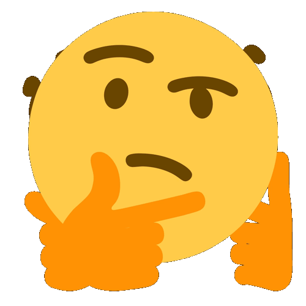

⚠️️ **still in progress** ⚠️️

# Intro to GIF Workshop
Class Files for Intro to GIF Workshop

Links: [Submit Suggestion](https://github.com/zachkrall/gif-workshop/issues), [Send Email](mailto:zach@zachkrall.com)

---

## Table of Contents
* What are GIFs?
  * Image files
* Why would we want to use them?
  * Beginning origins on the internet
  * Contemporary social conversation
  * Artworks (few examples of GIF based art)
* Setting up Photoshop environment to use GIFs
  * Timeline vs Frame Animation
  * Framerate, Keyframing, and Layers
     * [Null Sleep Frame Delay Browser](http://nullsleep.tumblr.com/post/16524517190/animated-gif-minimum-frame-delay-browser)
* Importing and using Video
  * Breif overview of using After Effects to prepare GIFs
* Animation Techniques
  * Looping
  * "Boomerang"
  * Meme Text Overlay
  * **REAL CONCERN**: seizure triggers (do some research on best practice to avoid this)
* Exporting
  * for Web / Art purposes
  * File Size & Image Quality
* Uploading / In Use
  * file sharing websites
  * social media
  * presentations & lectures

---
  
# Submit your creations!
 
Please do not forget to send a balloon with your beautiful contributions to internet culture: 🎈 [balloon.io/SVABFAGIF](https://balloon.io/SVABFAGIF) (ask for password in class)
